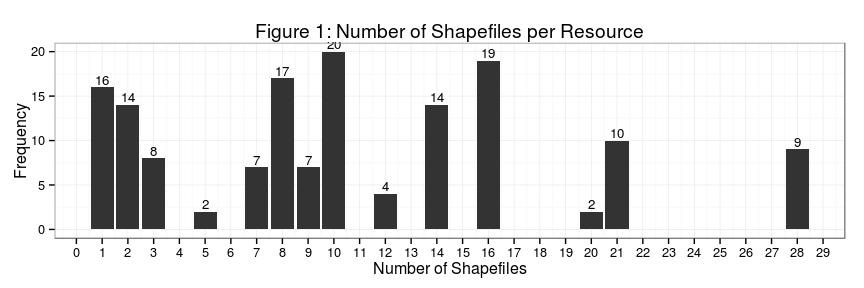

# UNOSAT Geo-preview analysis
Luis Capelo  
July 28, 2015  

[UNOSAT](https://test-data.hdx.rwlabs.org/organization/un-operational-satellite-appplications-programme-unosat) is the organization with the largest number of geographic datasets on HDX. At the time of writting, UNOSAT has nearly **300 datasets on HDX**, 180 of those containing zipped shapefiles. 

Zipped shapefiles are "geo-previable". That is, automatically HDX's geo-preview bot will try to generate interactive previews for the datasets that have those resources. 

### Issue
The issue that we are facing is that each zipped shapefile contains multiple layers. The geo-preview is able to select *one* of those layers and generate a preview. However, at times the layer selected is different than the description provided in the dataset. This generates confusion to the user.

### Context
The [scraper that creates those datasets](https://github.com/luiscape/hdxscraper-unosat) was designed to collect data from [UNOSAT's product website](http://www.unitar.org/unosat/). It goes to every product page, scrapes the information, adapts that information to the HDX schema, filters to select only products published after January 2014, and also filters for products that contain geographic files (many only contain PDF files).

The issue here is that UNOSAT organizes its products based on analysis (i.e. there is one product per analysis). However, they organize the product data (i.e. SHP layer) **based on a unique crisis id**. In practical terms, what that means is that a single ZIP package may contain dozens of layers for each analysis conducted for a certain crisis. That doesn't break the geo-preview, but it causes confusion to users.

# Solution
This repository analyzes all of datasets owned by UNOSAT. It will analyze each resource from those datasets and evaluate how many files it has and if those files are shapefiles or not. Read the [README.md](../README.md) file for more details of setup and usage.

**Resources that have a single shapefile are previewed correctly and match the description of the dataset.**

Figure 1 shows a distribution with the number of shapefiles per resource. There we see that 16 resources contain a single dataset. I have manually reviewed a number of those resources and their shapefiles seem to match the description of the dataset. In the recommendations section I outline what possible actions can be taken to address the geo-preview issue.

 

### Recommendations

As a result, I see two possible recommendations:

1. **Manually edit datasets**: activate the geo-preview only on those datasets in which the resources have a single shapefile. This would include editing ~16 datasets and keeping watch for future additions. 
2. **Expose Geo-preview Through API call**: at the moment the geo-preview is automatic. It detects resources that could be previewed and activates the geo-preview without user intervention. If we added a property to a dataset (i.e. `geo_preview: false`), an user could have more control over what to preview and what not to preview. This could be coded into the scraper and configured to only activate the geo-preview on those datasets that have a single shapefile per resource.

`1` is short-term; `2` is medium / long-term. 

`2` is preferred as I believe this kind of issue could become more and more common.
